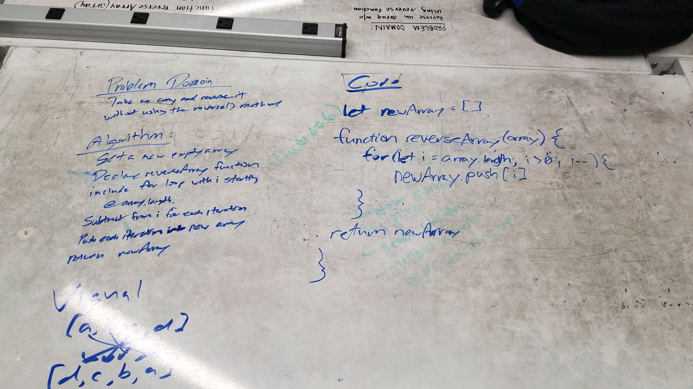

# Reverse an Array

Write a function called reverseArray which takes an array as an argument. Return the provided array argument with elements in reversed order.

## Challenge

Write a function called reverseArray which takes an array as an argument. Return the provided array argument with elements in reversed order.

## Solution
